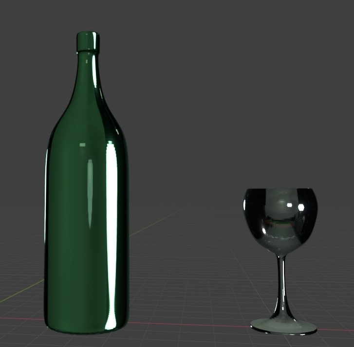

**Ecco alcune esercitazione di modelli 3D fatte con blender**

Questo è stato un primo tentativo di realizzare un calice di vino usando un metodo molto semplice, disegnandolo prima in 2 dimensioni attraverso lo strumento path di blender e infine usando lo strumento spin per ruotarlo e renderlo una figura 3d

Questa invece è stata la realizzazione di un calice di vino con una bottiglia fatti parrtendo da un cilindro e poi suddividendolo in anelli e modificandolo deformando gli anelli in vari livelli

